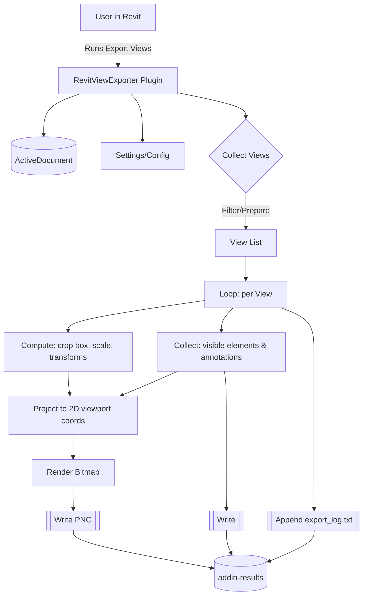
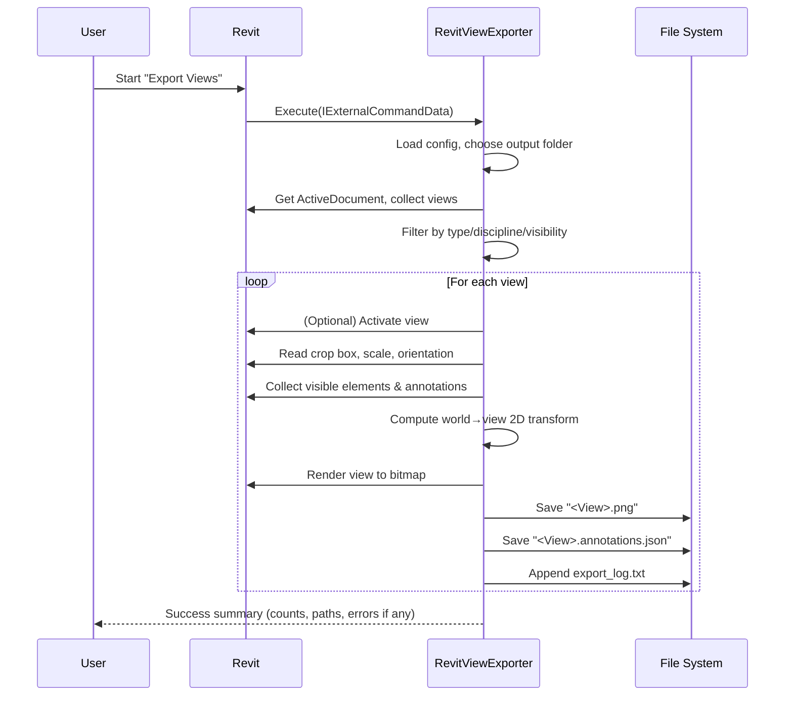
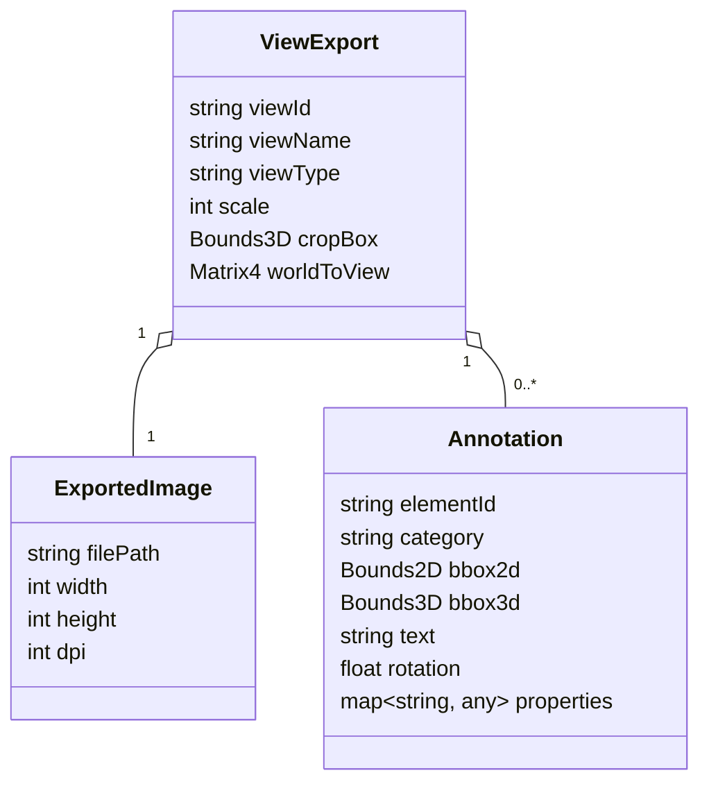

## RevitViewExporter Plugin – Process Overview

### High-level overview
- **Goal**: Export Revit views as images and structured annotation data.
- **Outputs**: One PNG per view, `<View>.annotations.json`, and `export_log.txt` in `addin-results`.

### Architecture diagram

### Runtime sequence

### Data model (simplified)

### Notes
- Files are saved under `addin-results` at the repository root.
- The log file `export_log.txt` records view-level processing details.
- The process can also be triggered headlessly via `run_headless_export.bat` if supported.

